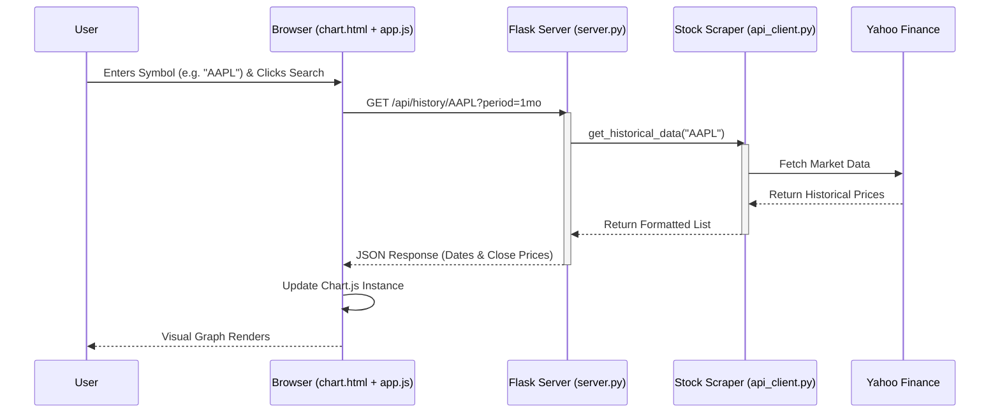

# System Flowchart

## Component Interaction

1.  **User Interface**: The user interacts with the input field in `chart.html`.
2.  **Client Logic**: `app.js` listens for the click event and initiates an asynchronous `fetch` request.
3.  **Web Server**: `server.py` receives the request, handles CORS headers, and routes it to the specific API function.
4.  **Data Service**: `api_client.py` abstracts the complexity of `yfinance`. It converts the raw DataFrame into a simple list of dictionaries.
5.  **External Source**: `yfinance` connects to Yahoo's servers to pull the latest market data.
