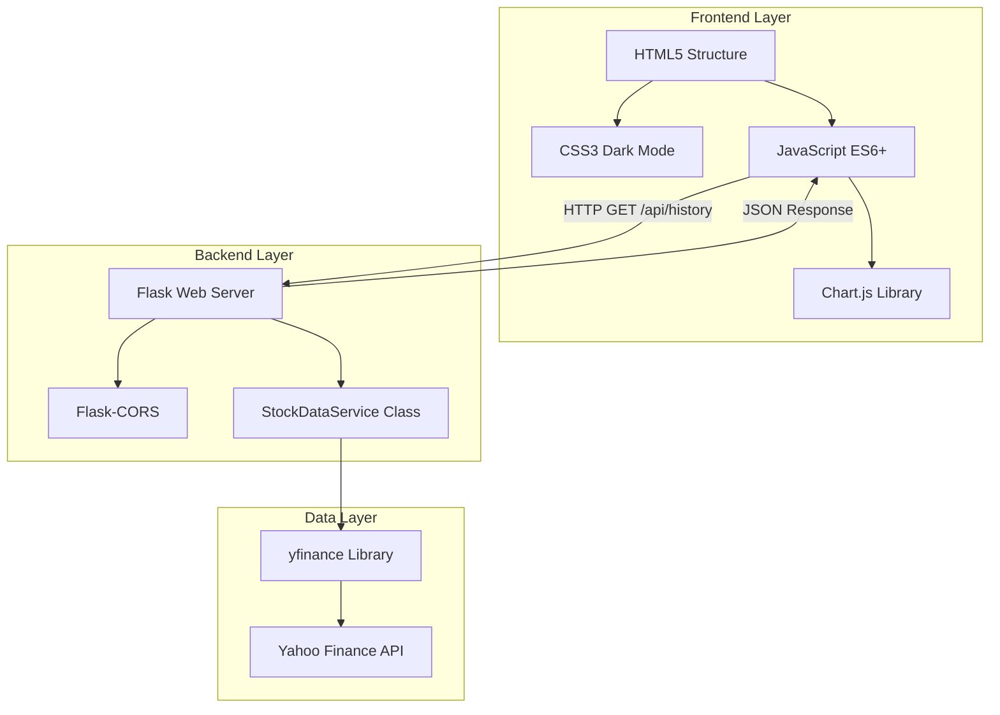

# Tech Stack Architecture

## Description
*   **Frontend**: Runs in the browser. Uses Vanilla JS to fetch data and Chart.js to render it.
*   **Backend**: Runs locally on port 5000. Flask handles the routing and CORS headers.
*   **Data**: Python logic (`api_client.py`) uses `yfinance` to strip and format data effectively for the UI.
