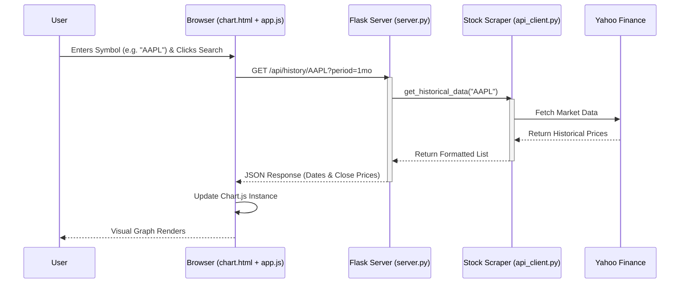

Run the command "curl http://localhost:5000/api/quote/AAPL" to get the stock data.

Run the command "python api_client.py" to start the client.

Run the command "python server.py" to start the server.

Open the file "chart.html" in a web browser to view the chart.

Enter a stock symbol in the search bar to view the stock's chart.

The chart will update in real-time as the stock's price changes.

Check this page: https://algotrading101.com/learn/yahoo-finance-api-guide/#:~:text=Overall%2C%20RapidAPI%20is%20a%20bit,you%20could%20want%20to%20know.

Operating Margin 
Gross Margin

Stock Forecasting using Linear Regression

Projected EPS × Expected P/E Ratio for stocks or Target Price = (Costs + Desired Profit) / Units for products, with stock targets also using methods like Current Price × (Current P/E / Forward P/E), while technical analysis uses patterns like Fibonacci levels. 
For Stocks (Valuation)
P/E Ratio Method:
Price Target = Projected Earnings Per Share (EPS) × Expected Price/Earnings (P/E) Ratio.
Example: $5 EPS × 20 P/E = $100 Target.
P/E Ratio Adjustment:
Price Target = Current Price × (Current P/E Ratio / Forward P/E Ratio).
Example: $50 Price × (20 Current P/E / 15 Forward P/E) = $66.67 Target. 

Technical Methods (Price Action & Patterns)
Chart Patterns:
How: Identify patterns (triangles, flags) and measure the pattern's height, adding it to the breakout price for a resistance target.
Support and Resistance Levels:
How: Identify price levels where a stock has historically struggled to break above (resistance) or below (support).
Moving Averages/Indicators:
How: Set targets at the next resistance level or upper Bollinger Band after a price crosses a moving average. 

Common Calculation Methods
Simple Growth:
Formula: Current Price × (1 + Expected Return %).
Example: A stock at $100 with a 20% expected return has a target price of $100 * (1 + 0.20) = $120.
Earnings-Based (P/E Ratio):
Formula: Projected Earnings Per Share (EPS) × Expected P/E Ratio.
How it works: Analysts forecast future earnings and apply a reasonable P/E multiple they expect the market to pay, providing a future-looking target.
Future Value (FV) for Investments:
Formula: FV = PV × (1 + r)^n (where PV=Present Value, r=rate, n=periods).
How it works: Estimates what an investment will be worth in 12 months, considering interest or expected growth, useful for general savings or portfolio growth. 

Dip Finder

DCF Calulator 

# System Flowchart

## Component Interaction

1.  **User Interface**: The user interacts with the input field in `chart.html`.
2.  **Client Logic**: `app.js` listens for the click event and initiates an asynchronous `fetch` request.
3.  **Web Server**: `server.py` receives the request, handles CORS headers, and routes it to the specific API function.
4.  **Data Service**: `api_client.py` abstracts the complexity of `yfinance`. It converts the raw DataFrame into a simple list of dictionaries.
5.  **External Source**: `yfinance` connects to Yahoo's servers to pull the latest market data.
